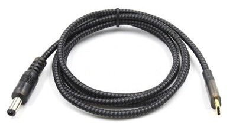

# pdc-control

An attempt to reverse engineer USB protocol for controlling/flashing PDC001 cables.

## WEB-PDC001



[Product page](https://www.aliexpress.com/i/32888090208.html)

This cable allows any Power Delivery compatible charger/powerbank to become universal power supply. Very useful for powering tools like TS100 soldering iron.

Cable must be configured using Windows-only program. 
PDC001 can read out supported PD modes (PD version, voltage profiles), force preprogrammed voltage or select one of supported voltages (fixed or adjustable).

## Build

hidapi is required

MacOS:
```bash
$ brew install hidapi
$ make
```

